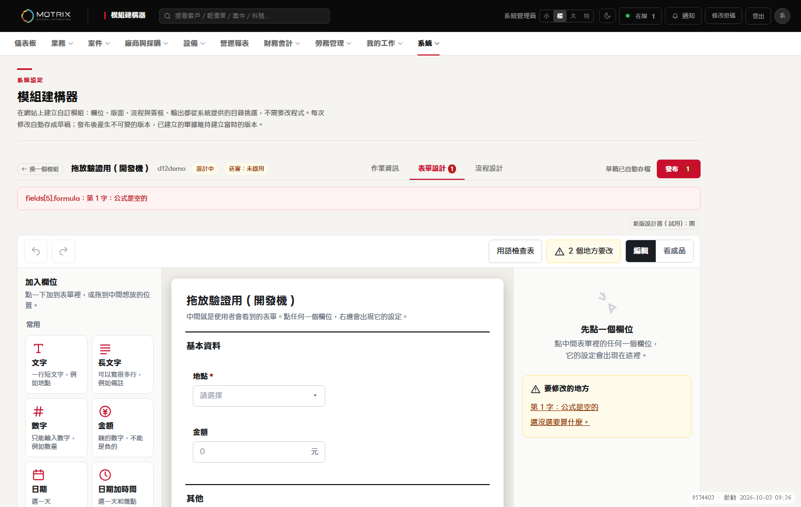
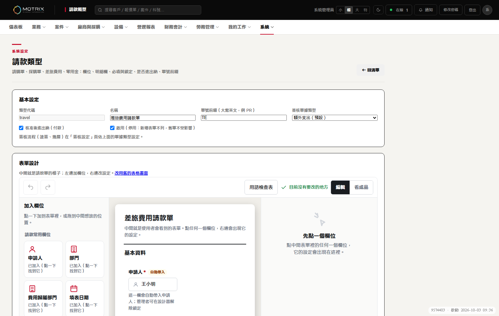
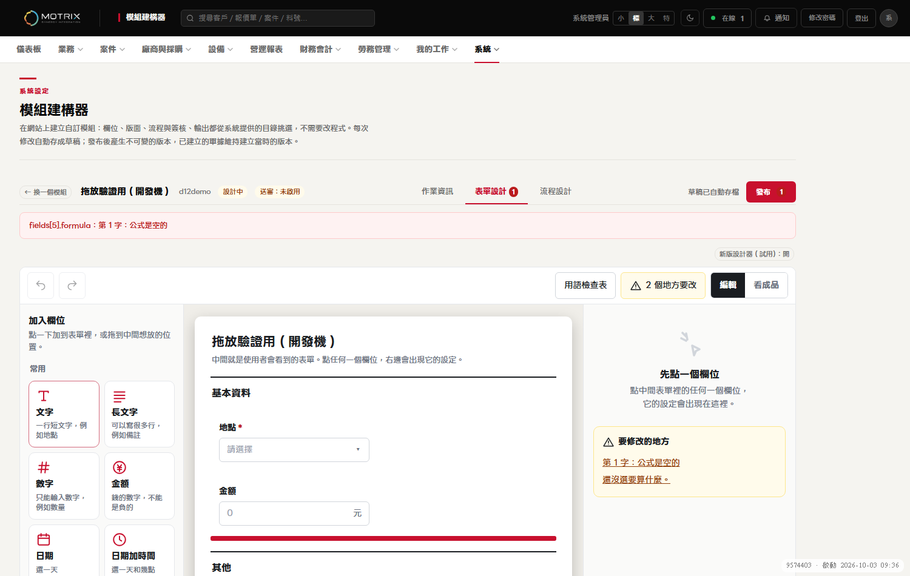

# D12 驗證指引：新「表單設計器」預設開，請用真滑鼠拖放驗一次

給：使用者（約 15 分鐘）。這份是白話步驟；做完請依「§6 回報」告訴我結果。**不用碰正式機**，全部在一台獨立的開發機上做，資料是全新的測試資料，亂改也不會影響任何正式資料。

## 0. 這次要驗什麼

第 33 班起，「模組建構器」和「請款類型」兩個頁面的**新設計器改成預設就開**（以前要自己按開關才看得到）。程式測試只能「模擬」拖放，所以**請你用真的滑鼠親手拖一次**，確認拖放手感和結果都對。這個驗過，D12 才能上線。

## 1. 先打開開發機

1. 在瀏覽器網址列輸入：**http://localhost:8870/**
2. 登入：帳號 **admin**、密碼 **D12-verify-Mouse-2026**（只在這台開發機有效）。
3. 打不開（連線被拒絕）？在 PowerShell 執行這一行，等它印出「完成」再重新整理：
   `powershell -ExecutionPolicy Bypass -File D:\開發測試檔\wt-d12\tools\platform\d12_verify_server.ps1`
   （要關掉開發機：同一行最後加 ` -Stop`。）

## 2. 兩個要驗的頁面

| 頁面 | 網址（直接貼） | 進去後 |
|---|---|---|
| ① 模組建構器 | http://localhost:8870/pages/module-builder.html?key=d12demo | 上方點「**表單設計**」（第二個頁籤） |
| ② 請款類型 | http://localhost:8870/pages/expense-types.html?key=travel | 直接就在設計畫面（若看到表格而不是三欄，見 §5） |

**預設應該就是新設計器**（三欄：左邊「加入欄位」、中間是表單、右邊是設定；右上角有「新版設計器（試用）：開」）。你什麼開關都不用按。

> 想確認「全新使用者」的樣子：用瀏覽器的**無痕視窗**開上面兩個網址（登入後），應該一樣是新設計器。

## 3. 真滑鼠拖放（在頁面 ① 做；每項請真的用滑鼠按住拖）

測試模組有這幾個區塊：「基本資料」（地點、金額）、「其他」（備註、事由）、「費用」（明細、總額）、「空的區塊（拖進來試試）」。

| # | 動作 | 應該看到 |
|---|---|---|
| ① | 按住左邊「**長文字**」圖示，往中間表單拖，在欄位之間慢慢移動 | 滑鼠經過欄位之間時出現一條**紅色細線**（插入位置，見下圖） |
| ② | 在「地點」和「金額」中間放開 | 新欄位出現在紅線的位置，右邊跳出它的設定 |
| ③ | 按住中間的「**備註**」，拖到「基本資料」區塊裡放開 | 備註換到「基本資料」（**不是複製一份**）；「其他」少一個欄位 |
| ④ | 按住某個欄位，拖到**它自己**的上半或下半再放開 | 欄位留在自己前面／後面，**不會消失** |
| ⑤ | 把任一欄位拖進最下面的「**空的區塊**」（虛線框）放開 | 欄位進到那個區塊 |
| ⑥ | 點「地點」，右邊「選項」清單：按住每一列左邊的 ⠿ 上下拖 | 選項順序改變；按 Enter 能新增一列、✕ 能刪除，仍正常 |
| ⑦ | 開始拖一個欄位，拖到一半按鍵盤 **Esc**（或拖出瀏覽器視窗再放開） | 什麼都不會改變 |
| ⑧ | （有觸控螢幕才做）手指長按拖曳 | 瀏覽器若不支援觸控拖放，用欄位上的 **↑ ↓** 按鈕也要能移動 |

每做完一項，順便看一下：畫面上方是否出現紅色錯誤、欄位有沒有消失或重複。頁面右上「撤銷」（或 Ctrl+Z）應該能回到上一步。

**在頁面 ② 請款類型**：同樣做 ①②③（欄位在「申請人、日期、明細」之間拖），確認它們同樣能拖；這頁改完要自己按「儲存草稿」才會存（和舊畫面一樣）。

## 4. 這些請順便看（各 1 分鐘）

- 加欄位、改欄位名稱後，頁面上方會出現「草稿已自動存檔」（模組建構器）；請款類型頁要按「儲存草稿」。
- 兩個頁面都按一下「看成品」，確認表單長相正常，再按「編輯」回來。
- 切到深色主題看一下有沒有文字看不清楚。

## 4b. 你回饋後我改的兩件事（請一併看一下）

- **設計器置中、寬度隨視窗伸縮**：把瀏覽器視窗拉寬、縮窄（或按 Ctrl＋滾輪縮放），設計器整個區塊會跟著變寬變窄、左右留白對稱；中間「表單預覽」欄吃剩下的寬度。視窗窄到約 1100px 以下會改成「一次顯示一欄＋底部切換」，手機寬度不會出現橫向捲動。
- **「預覽表單」的黑色橫條已修**：以前按「預覽表單」後，預覽區最上面會多一條黑帶蓋住「自訂模組」標題；現在預覽區上緣是淺色、標題完整。（模組建構器用的是同一個預覽元件，一併修好。）
- 畫面右下角若出現一小條粉紅色的「執行中 xxxxxxx 落後 N 個異動 — 建議重新啟動」：這是**開發機的版本提示**（開發機跑的程式比我最新改的舊了），不是系統 bug；我重啟開發機後就會消失。

## 5. 怎麼切回舊畫面（以及再切回新的）

| 頁面 | 切回舊畫面 | 再切回新設計器 |
|---|---|---|
| 模組建構器 | 按右上「**新版設計器（試用）：開**」那個按鈕（變成「關」），或網址最後加 `&designer=0` | 再按一次那個按鈕，或網址加 `&designer=1` |
| 請款類型 | 點畫面上的「**改用舊的表格畫面**」，或網址加 `?designer=0` | 點「**改用新的設計畫面**」，或網址加 `?designer=1` |

- 切換**只記在你這個瀏覽器**，不會影響別人，也**不會改到任何資料**。
- 切回舊畫面之後，下次直接開頁面會維持舊畫面（它記住你的選擇）。想回到「預設開」：點上面的「再切回新設計器」，或用無痕視窗。

## 6. 回報（做完請告訴我）

請直接回我（越短越好）：

1. **全部正常** 或 **哪幾項（①～⑧、頁面 ②）不正常**。
2. 不正常的項目，請寫：**第幾項**、用的**瀏覽器與版本**（Chrome／Edge／Firefox…）、**滑鼠或觸控板**、**你看到什麼／預期是什麼**；能截圖最好（拖到一半的畫面也行）。
3. 如果頁面出現紅色錯誤或整頁壞掉：按 F12 → 「Console」分頁，把紅色文字複製貼給我。
4. 預設開這件事你的決定：**可以上線 / 先不要上線**。

## 7. 給主持與稽核（技術備註）

- 分支：`wip/t34-d12-c7`（基底 origin/platform）。變更：兩個 JS 檔各一行判斷（`localStorage` 沒設定＝開；設 `'0'`＝關）、`tests/_e2e_login.py`（既有 e2e 一律釘舊畫面，避免預設翻轉讓舊測試變紅）、新 e2e `test_e2e_designer_default_on_2026_10_03.py`（預設開、`?designer=0` 回退並記住）。
- 開發機：`tools/platform/d12_verify_server.ps1`（port 8870、只聽 127.0.0.1、關閉寄信與雲端、全新資料庫）＋ `d12_verify_seed.py`（冪等）。
- 自動化的「真滑鼠」輔助證據（Playwright `page.mouse`）見 `test_e2e_designer_real_mouse_2026_10_03.py`；**不取代使用者親手驗證**（不同瀏覽器、觸控板、手感）。
