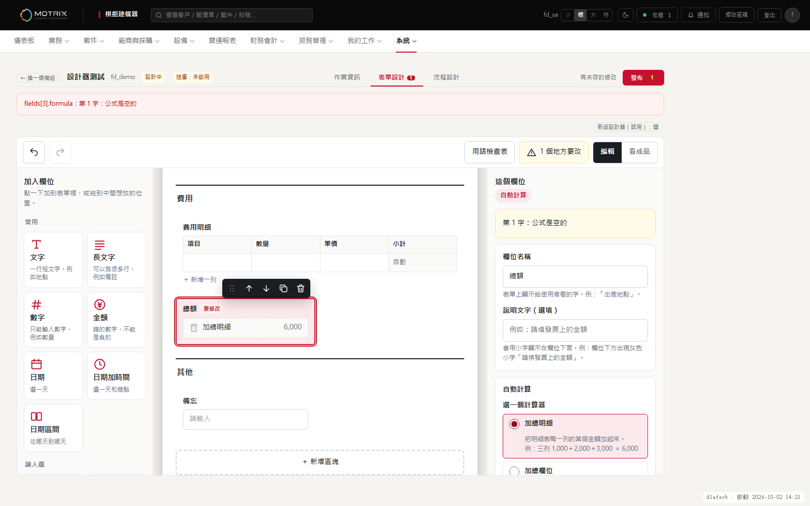
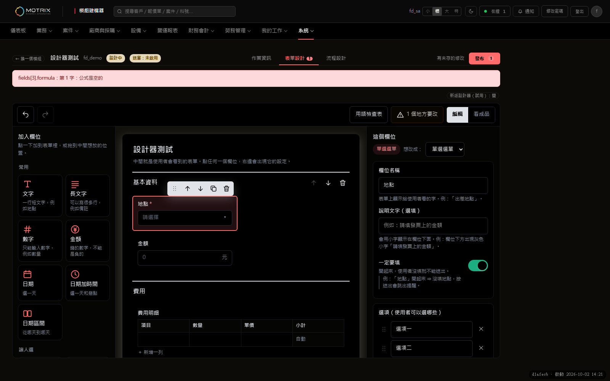
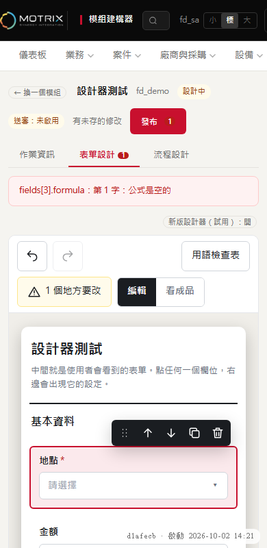
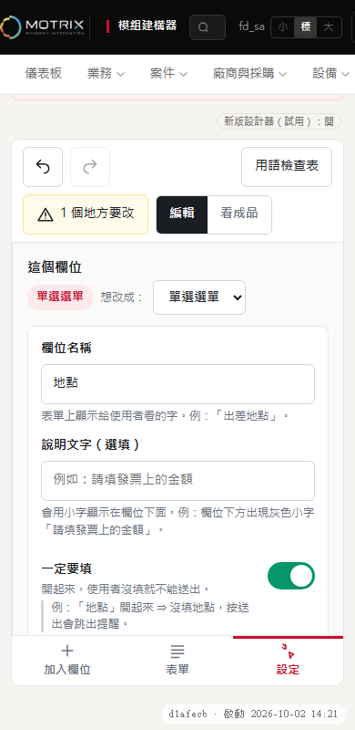
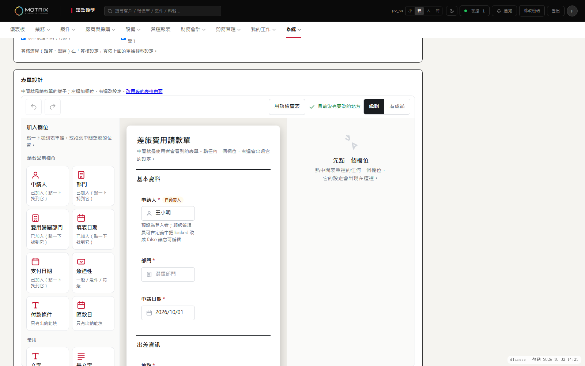
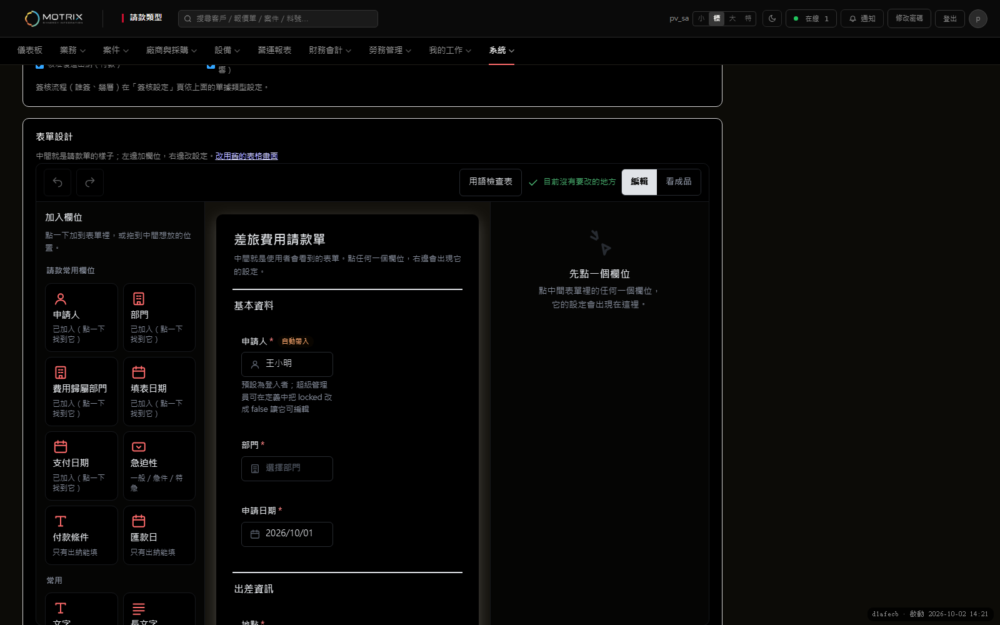
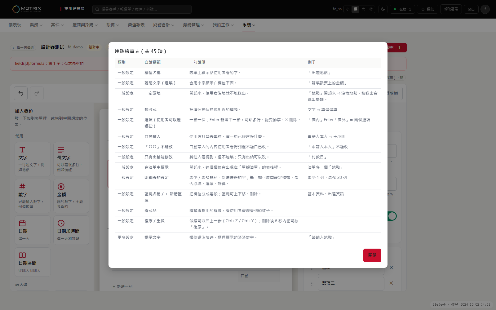

# 表單設計器：預覽說明（給使用者）

這一頁告訴你：**怎麼打開新設計器、要看什麼、怎麼自己驗證拖放、以及需要你決定什麼**。新設計器目前是「選用」的，**預設是關閉的**，舊畫面完全沒動；你不按它，什麼都不會變。

## 1. 它是什麼

模組建構器與請款類型原本用「欄位表格」設計表單（代碼、型別、預填鎖定、公式…）。新設計器改成三欄：**中間就是使用者實際看到的表單**，左邊點一下加欄位，右邊用白話設定選到的那個欄位。資料還是同一份（存進去的內容和舊畫面一樣，舊畫面讀得懂）。

## 2. 怎麼打開（兩處都是用同一個設計器）

| 地方 | 怎麼開 | 怎麼關回舊畫面 |
|---|---|---|
| **模組建構器** | 系統 → 模組建構器 → 開一個模組 → 上方「表單設計」→ 按「**新版設計器（試用）：關**」（按一下變「開」）。或網址最後加 `&designer=1`。 | 再按一下同一個按鈕，或網址加 `&designer=0` |
| **請款類型** | 系統 → 請款類型 → 開一個類型，網址加 `?designer=1`（例：`/pages/expense-types.html?designer=1`）。 | 點「改用舊的表格畫面」，或網址加 `?designer=0` |

小提醒：只有「最高管理者」看得到這兩頁。按鈕的開關只記在**你這個瀏覽器**，不會影響別人。來回切換**不會改到資料**。

## 3. 請你看什麼（約 10 分鐘）

1. **看得懂嗎？** 每個設定都有一句說明和例子；右上「用語檢查表」把全部字句列成一張表（共 38 項），哪句看不懂請圈起來給我。
2. **加欄位**：左邊點「文字」「金額」「單選選單」…，或拖到中間想放的位置。
3. **改欄位**：點中間任一欄位，右邊會出現它的設定（名稱、說明、一定要填、選項…）。
4. **選項清單**：把「地點」改成「單選選單」，在選項格打字按 **Enter** 就多一格；一次貼上很多行會自動拆成很多格（上限 500 個）。
5. **自動計算**：點「總額」→ 選「加總明細」，預覽會直接顯示範例數字，不用打公式。
6. **自動帶入**：點「申請人」→「自動帶入」下拉，每個選項下面有說明和「使用者會看到：…」。
7. **刪除可反悔**：刪掉一個欄位，下方會出現「復原」；Ctrl+Z／Ctrl+Y 也可以。
8. **看成品**：右上「看成品」把編輯用的框線藏起來。
9. **深色與手機**：切到深色主題、用手機寬度（三欄會變成「加入欄位／表單／設定」三個切換鈕）。
10. **草稿**：模組建構器改動後約 4 秒自動存成草稿；請款類型頁要自己按「儲存草稿」（和舊畫面一樣）。兩邊都是按「發布」才給大家用。

| 深色 | 手機：表單 | 手機：設定 |
|---|---|---|
|  |  |  |

## 4. 五個小練習（只用點的）

1. 加一個「備註」長文字框。
2. 把「地點」改成選單，選項是「國內」「國外」。
3. 把「金額」搬到最下面的區塊。
4. 讓「總額」自動加總費用明細的小計。
5. 把「備註」從清單中隱藏。

（右下角原型有「試試看」打勾清單；正式版的這五題已經做成自動測試，每次改版都會跑。）

## 5. 真滑鼠拖放：請你親手驗一次（我在測試環境做不到）

我的自動測試只能模擬「拖放事件」，**沒辦法用真滑鼠拖**，所以請你用真滑鼠確認這幾件事（用任何一個有 3 個以上欄位的表單）：

| 步驟 | 應該看到 |
|---|---|
| ① 按住左邊的「長文字」圖示，往中間表單拖 | 滑鼠經過欄位之間時，出現一條**紅色細線**（插入位置） |
| ② 在兩個欄位中間放開 | 新欄位就出現在那條線的位置，右邊跳出它的設定 |
| ③ 按住中間某個欄位，拖到**另一個區塊**放開 | 欄位換到那個區塊（不是複製一份）；原來的區塊少一個 |
| ④ 把欄位拖到**自己的上半／下半**再放開 | 放在自己前面／後面，不會消失 |
| ⑤ 拖到**空的區塊**（虛線框）放開 | 欄位進到那個區塊 |
| ⑥ 右邊「選項」清單：按住左側的 ⠿ 圖示上下拖 | 選項順序改變，Enter 新增、✕ 刪除仍正常 |
| ⑦ 拖到一半按 **Esc** 或拖出視窗放開 | 什麼都不會改變 |
| ⑧ 手機（觸控）長按拖曳 | 瀏覽器若不支援觸控拖放，用欄位上的 ↑ ↓ 按鈕移動也要能完成 |

任何一項不符合，請告訴我是第幾項、用什麼瀏覽器。

## 6. 目前還沒做的（請知道）

- **兩個人同時改同一份草稿**：現在是後存的覆蓋先存的，不會提醒（設計提案見 `DRAFT-CONCURRENCY-DESIGN.md`，等你決定要不要做）。
- **自動帶入**有幾個來源要看實際資料（例如「這個案件的客戶」只在掛在案件底下的表單才有）；選單裡只會列出這張表單真的能用的。
- 請款單的「申請人」欄位目前的說明文字裡有英文字（`locked`、`false`），那是出貨定義裡寫的，不是設計器產生的，建議另外改成白話。

## 7. 需要你決定：預設要不要開

| 選項 | 內容 | 風險 |
|---|---|---|
| A. 兩處都預設開新設計器 | 最高管理者一進去就是新畫面，可按鈕切回舊的 | 習慣舊畫面的人要多按一下 |
| B. 只有模組建構器預設開，請款類型維持舊的 | 請款類型欄位有固定規則（保留欄位、明細表），先用建構器累積使用經驗 | 兩處畫面不一致一段時間 |
| C. 維持預設關閉（現狀） | 完全不變，想用的人自己打開 | 沒人用就沒有回饋 |

我的建議：先用 **C** 讓你和 1～2 位管理者實際用一週，確認拖放與用語沒問題，再改 **A**，舊畫面再保留一個版本當退路。

（改預設只需要改兩個檔案各一行的判斷；資料不用動、可隨時退回。）
